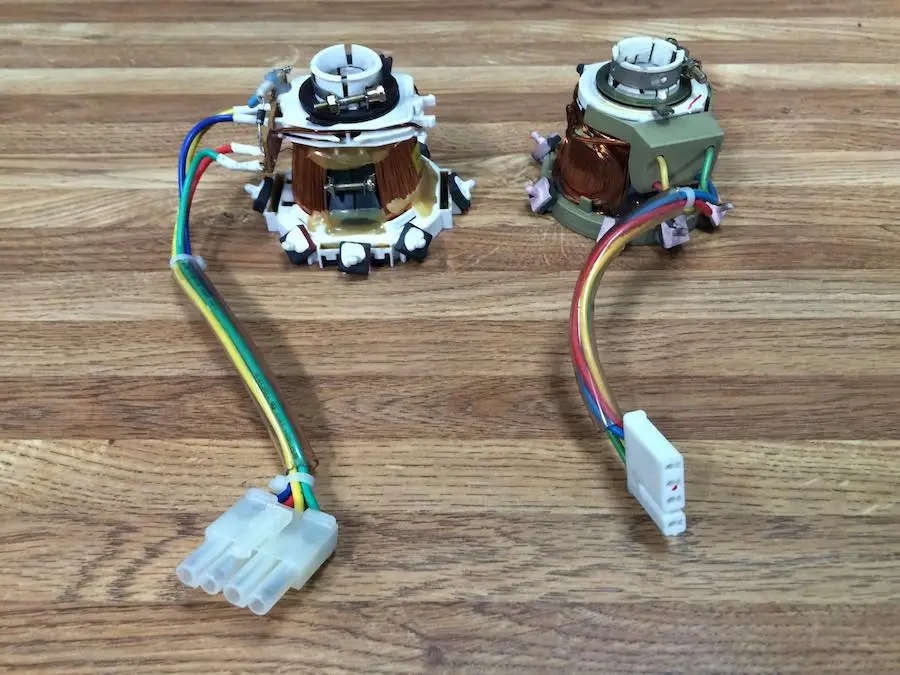

# Macintosh Classic (II) Analogboard recreation

This is a tested and working analog board recreation of the Macintosh Classic analog board (820-0395-A). The provided files are licensed under CC-BY-NC-SA - they are NOT intended for commercial use.

## General

This is a 1-1 reproduction of the Classic (I and II) analog board 820-0395-A / 630-0420, "early" revision.

|  |  |
| -------------------------------------------------- | -------------------------------------------------- |

## Yoke types

Somewhere during the development of the Classic II Apple changed the CRT yoke type. There are two different yokes which were used during that time, and they are not interchangeable. This replica is using the **A-TYPE** yoke, which is the left one in this photo.  Though It may be possible to interchange the entire yoke on the CRT, but i have not test this.

## Board

This board can be produced with 1.6MM thickness. 
ENIG Surface finish is advised due to slot copper peeling on HASL finish.

## BOM

This is a BOM for the 820-0395-A / 630-0420, "**early**" revision board. 
*Although I have done my utmost to ensure an accurate list, I cannot rule out that there are errors in the BOM. Use at your own risk*

| Ref  | Part/Value                 | Comment                       |
| ---- | -------------------------- | ----------------------------- |
| BD1  | Molex 1531-1046            |                               |
| BP1  | 250V Euro connector        |                               |
| BP2  | MOLEX 39281043             |                               |
| BP3  | KF2510 2P                  |                               |
| CF1  | 47uF/25V                   | 667-ECA-1VM470B               |
| CF2  | 220uF/16V                  | 667-EEU-FM1H221               |
| CF3  | 1000uF/16V                 | 667-EEU-FS1V102LB             |
| CF4  | 470uF/25V                  | 667-EEU-FR1V471B              |
| CF5  | 1uF/50V                    |                               |
| CF6  | 0.1uF                      |                               |
| CF7  | 0.18uF                     |                               |
| CF8  | 330pF                      |                               |
| CL1  | 1uF/50V                    | 667-EEU-EB1H100S              |
| CL2  | 4.7uF/250V                 | 647-UPW2E4R7MPD               |
| CL3  | 1uF/50V                    | 647-ULD1H010MDD1TD            |
| CL4  | 0.01uF/2KV (103Z)          |                               |
| CL5  | 0.01uF/2KV (103Z)          |                               |
| CL6  | 333J / 400V                |                               |
| CL7  | 0.1uF 5% 100V MKT          |                               |
| CL8  | 0.0022uF (222J)            |                               |
| CL9  | 0.01uF/2KV (103Z)          |                               |
| CL10 | 395J                       |                               |
| CP1  | 220uF/250V                 | 647-LGU2E221MELY              |
| CP2  | 1000uF/35V                 | 667-EEU-FM1V102               |
| CP3  | 10uF/25V                   | 647-UKL1H100MDDANA            |
| CP4  | 47uF/25V                   | 667-ECA-1VM470B               |
| CP5  | 1uF/50V                    | 647-ULD1H010MDD1TD            |
| CP6  | 2200uF/10V                 | 667-EEU-FM1E222L              |
| CP7  | 1000uF/10V                 | 667-EEU-FR1E102               |
| CP8  | 2200uF/16V                 | 667-EEU-FM1E222L              |
| CP9  | 470uF/25V                  | 667-EEU-FR1V471B              |
| CP10 | 470uF/25V                  | 667-EEU-FR1V471B              |
| CP11 | 220uF/50V                  | 667-EEU-FM1H221               |
| CP12 | 1000uF/16v                 | 667-EEU-FS1V102LB             |
| CP13 | 22uF/250V                  | 647-LGU2E221MELY              |
| CP15 | 0.0047uF                   | Axial 4n7 F160 Philips        |
| CP16 | 0.22UF 250V (XE224)        |                               |
| CP17 | 0.22uF MKT 63V (5%)        |                               |
| CP18 | 0.033uF 630V 3%            |                               |
| CP19 | 10nF 250V                  |                               |
| CP20 | 0.001uF (102)              |                               |
| CP21 | 0.0068uF (682K)            |                               |
| CP22 | 0.0047uF                   |                               |
| CP23 | 270pF/2KV (271J)           |                               |
| CP24 | 0.1uF 5% 100V MKT          |                               |
| CP25 | 0.22uF 63V MKT             |                               |
| CP26 | 0.22uF (223Z)              |                               |
| CP27 | 0.22uF 63V MKT             |                               |
| CP28 | 0.1uF 5% 100V MKT (XE104)  |                               |
| CP29 | 0.0033uF (3300nF) 250V     |                               |
| CP30 | 0.0033uF (3300nF) 250V     |                               |
| CP31 | 1000uF/6.3V667-EEU-FS1A102 | 667-EEU-FS1A102               |
| CP34 | 1uF/50V                    | 647-ULD1H010MDD1TD            |
| CP35 | 1uF/50V                    | 647-ULD1H010MDD1TD            |
| CP36 | 2200uF/10V                 | 667-EEU-FM1E222L              |
| CP37 | 1uF/50V                    | 647-ULD1H010MDD1TD            |
| CP38 | 10nF 250V                  |                               |
| CP39 | 470pF/1KV                  |                               |
| CV1  | 47pF                       |                               |
| DF1  | 1N4001                     |                               |
| DF2  | 1M4148                     |                               |
| DL1  | 1N4937                     |                               |
| DL2  | BA157                      |                               |
| DL3  | RGP02-12                   |                               |
| DL4  | BYT01-300                  |                               |
| DL5  | MR824                      |                               |
| DL6  | RGP02-12                   |                               |
| DL7  | 1N4148                     |                               |
| DL8  | 1N4148                     |                               |
| DL9  | 1N4148                     |                               |
| DL10 | 1N4001                     |                               |
| DL11 | 1N4148                     |                               |
| DP1  | BZX79C18 18V               |                               |
| DP2  | BYW76                      |                               |
| DP3  | 1N4148                     |                               |
| DP4  | 1N4148                     |                               |
| DP5  | BYT03-300                  |                               |
| DP6  | MR1045                     | Coolrib 8022BG-ND             |
| DP7  | EGP30D                     |                               |
| DP8  | BY73D                      |                               |
| DP9  | KBL08                      |                               |
| DP11 | B5V6PH                     | BZX79B5V6                     |
| DP12 | BYD34J                     |                               |
| DP13 | 1N4002                     |                               |
| DP14 | LM431                      |                               |
| DP15 | 1N4001                     |                               |
| FP1  | Fuse clips                 | 01000020Z / T3.15A            |
| IF1  | TEA2037                    |                               |
| IP1  | TDA4605                    |                               |
| IP2  | LM317T                     |                               |
| IP3  | 79L12                      |                               |
| IP4  | LM340T12                   |                               |
| J1   | Jumperwire                 |                               |
| J2   | Jumperwire                 |                               |
| J3   | Jumperwire                 |                               |
| J4   | Jumperwire                 |                               |
| J5   | Jumperwire                 |                               |
| J6   | Jumperwire                 |                               |
| J7   | Jumperwire                 |                               |
| J8   | Jumperwire                 |                               |
| J9   | Jumperwire                 |                               |
| J10  | Jumperwire                 |                               |
| J11  | Jumperwire                 |                               |
| J12  | Jumperwire                 |                               |
| J13  | Jumperwire                 |                               |
| JP1  | EMPTY AT 220V SETUP        | 110V Only                     |
| LL1  | Apple Custom Coil          |                               |
| LL2  | Apple Custom Coil          |                               |
| LP2  | Apple Custom Coil          |                               |
| LP3  | ELF656V                    | 27.0mH 1A                     |
| LP4  | Apple Custom Coil          |                               |
| LP5  | Apple Custom Coil          |                               |
| LP7  | 100UH                      |                               |
| PF1  | 100 / PT10LH01-101         | Vertical Size potentiometer   |
| PF2  | 2K2 / PT10LH01-222A        | Vertical Centering adjustment |
| PL1  | 2M2                        | Focus                         |
| PL2  | 2M2                        | Cut-Off                       |
| PL3  | 2K7 / PT10LH01-272A        | H. Center                     |
| PL4  | 68K / 	PT10MH02-683A    | Brightness range              |
| PP1  | 220 / PT10LV10-221A        | Voltage adjustment            |
| QL1  | BF421                      |                               |
| QL2  | IRF640                     |                               |
| QL3  | BC548B                     |                               |
| QL4  | BC548B                     |                               |
| QL5  | BF420                      |                               |
| QL6  | BC558                      |                               |
| QP1  | CNY17                      |                               |
| QP2  | IRF-BC40                   |                               |
| QP3  | BC548B                     |                               |
| QP5  | BC558B                     |                               |
| QP6  | BC548B                     |                               |
| QV1  | BC558                      |                               |
| RF1  | 820K 1/8W                  | Resistor Carbon               |
| RF2  | 150R 1/2W                  |                               |
| RF3  | 1K 1/8W                    | Resistor Carbon               |
| RF4  | 330K 1/8W                  | Resistor Carbon               |
| RF5  | 470K 1/8W                  | Resistor Carbon               |
| RF6  | 1R8 1/2W                   | Resistor Carbon               |
| RF7  | 3R3 1/2W                   | Resistor Carbon               |
| RF8  | 82K 1/8W                   | Resistor Carbon               |
| RF9  | 460R 1/8W                  | Resistor Carbon               |
| RF10 | 460R 1/8W                  | Resistor Carbon               |
| RF11 | 5.6K 1/8W                  | Resistor Carbon               |
| RF12 | 270R 1/2W                  | Resistor Carbon               |
| RL1  | 220R 1/2W                  | Resistor Metalfilm            |
| RL2  | 2R2 1/2W                   | Resistor Metalfilm            |
| RL4  | 360K 1/8W                  | Resistor Carbon               |
| RL5  | 4.7K 1/8W                  | Resistor Carbon               |
| RL6  | 1K 1/8W                    | Resistor Carbon               |
| RL7  | 1K 1/8W                    | Resistor Carbon               |
| RL8  | 1K 1/8W                    | Resistor Carbon               |
| RL10 | 22R 1/8W                   | Resistor Carbon               |
| RL11 | 1M 1W                      | Resistor Metalfilm            |
| RL12 | 470K 1W                    | Resistor Metalfilm            |
| RL13 | 1.5M	1W                 | Resistor Metalfilm            |
| RL14 | 3.9M 1W                    | Resistor Metalfilm            |
| RL15 | 150K 1W                    | Resistor Metalfilm            |
| RL16 | 43K 1/8W                   | Resistor Carbon               |
| RL18 | 820R 1/8W                  | Resistor Carbon               |
| RL19 | 68K 1/8W                   | Resistor Carbon               |
| RL20 | 22R 1/6W                   | Resistor Carbon               |
| RL23 | 2.2K 1/8W                  | Resistor Carbon               |
| RL24 | 1.8K 1/8W                  | Resistor Carbon               |
| RL25 | 100K 1/8W                  | Resistor Carbon               |
| RL26 | 4.7K 1/8W                  | Resistor Carbon               |
| RP1  | 22K 3W                     | Resistor Metalfilm            |
| RP2  | 20 COLD NTC                | NTC Resistor                  |
| RP3  | 6.8K 1/8W                  | Resistor Carbon               |
| RP4  | 200R 1/8W                  | Resistor Carbon               |
| RP5  | 100R 1/4W                  | Resistor Carbon               |
| RP6  | 4.7K 1/8W                  | Resistor Carbon               |
| RP7  | 10K 1/8W                   | Resistor Carbon               |
| RP8  | 3.3K 1/2W                  | Resistor Metalfilm            |
| RP9  | 220R 1/2W                  | Resistor Metalfilm            |
| RP10 | 10K 1/8W                   | Resistor Carbon               |
| RP11 | 820R 1/8W                  | Resistor Carbon               |
| RP13 | 1M 1W                      | Resistor Metalfilm            |
| RP14 | 220K 3W                    | Resistor Metalfilm            |
| RP15 | 7.5K 3W                    | Resistor Metalfilm            |
| RP17 | 3.9K 1/6W                  | Resistor Carbon               |
| RP18 | 220K 1W                    | Resistor Metalfilm            |
| RP19 | 220K 1W                    | Resistor Metalfilm            |
| RP23 | 510R 1/8W                  | Resistor Carbon               |
| RP24 | 560R 1/8W                  | Resistor Carbon               |
| RP27 | 20K 1/8W                   | Resistor Carbon               |
| RP28 | 47R 1/8W                   | Resistor Carbon               |
| RP30 | 7.5K 3W                    | Resistor Metalfilm            |
| RP32 | 1K 1/2W                    | Resistor Metalfilm            |
| RP33 | 4.7K 1/2W                  | Resistor Carbon               |
| RP34 | 1K 1/8W                    | Resistor Carbon               |
| RP35 | 100R 1/8W                  | Resistor Carbon               |
| RP36 | 220R 1/8W                  | Resistor Carbon               |
| RP37 | 2K 1/8W                    | Resistor Carbon               |
| RP38 | 100R 1/8W                  | Resistor Carbon               |
| RP39 | 22R 1/2W                   | Resistor Metalfilm            |
| RP40 | 220R 1/2W                  | Resistor Carbon               |
| RP41 | 2K 1/8W                    | Resistor Carbon               |
| RP42 | 10K 1/8W                   | Resistor Carbon               |
| RP43 | 30K 1/8W                   | Resistor Carbon               |
| RP44 | 22K 1/2W                   | Resistor Metalfilm            |
| RP45 | 22R 1/2W                   | Resistor Metalfilm            |
| RP46 | 470K 1W                    | Resistor Metalfilm            |
| RP47 | 10R 1/2W                   | Resistor Carbon               |
| RV1  | 220R 1/8W                  | Resistor Carbon               |
| RV2  | 220R 1/8W                  | Resistor Carbon               |
| RV2  | 330R 1/8W                  | Resistor Carbon               |
| SS1  | 57MM Speaker               |                               |
| ZL1  | Flyback                    | Transformer                   |
| ZP1  | 157-0130                   | Transformer                   |

## Schematic

See "schematic" directory for the corresponding schematics.

## License

The provided files are licensed under CC-BY-NC-SA - they are NOT intended for commercial use.

## Disclaimer

This project involves potentially lethal High-Voltage. Construction and operation of this circuit should only be performed by people familiar with best practices when operating with high voltage, and using extreme caution.
I will not be held liable for injury or even death resulting from this part. Build and use this part only at your own risk.